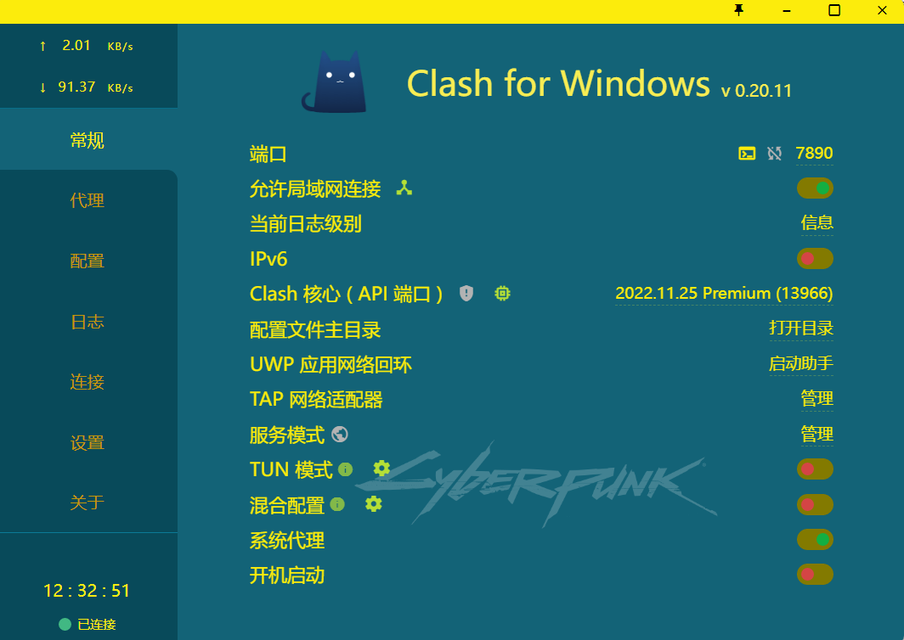
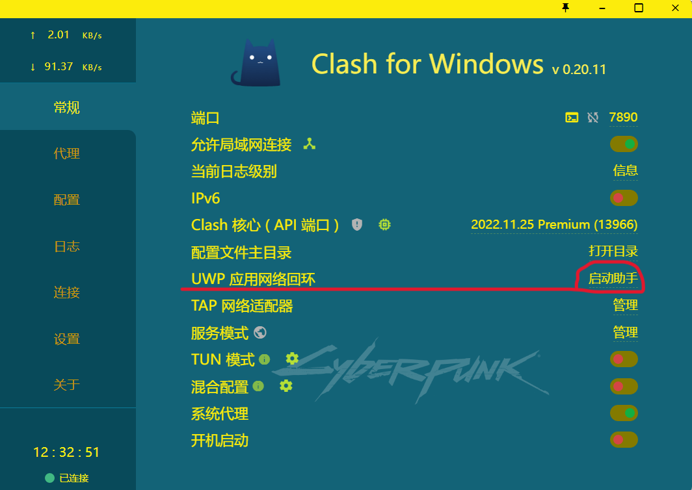

#Blog
# 科学上网后UWP应用连不了网的解决方法

## 前言

日常情况下我使用的是Clash的系统代理（附图）

当我使用邮件以及TODO时显示同步失败，当关闭Clash时又回复正常，由此判断出问题在Clash的代理上。

## 快速解决方法

1. 打开Clash，找到UWP应用网络回环，点击启动助手
   
2. 找到无法联网的UWP应用，将其复选框勾上，然后点击Save Change保存，此时相关的UWP应用已经可以连上网了。
  

## 以下是相关知识

### 什么是UWP应用

这里是相关介绍

[转跳](https://learn.microsoft.com/zh-cn/windows/uwp/get-started/universal-application-platform-guide)  
Windows自带商店的软件有些是UWP版（相较与官方版其常被人诟病）

### 什么是系统代理

系统代理设置顾名思义就是相关代理软件在系统设置里面设置一个代理服务器，让软件可以直接调用系统代理设置直接连接代理服务器，而不需要单独的配置。

这样所有的软件都可以知道现在有一个代理服务器可以连接，而且只要跟随系统代理设置即可连接，无需额外配置。

一般而言，只有浏览器（包括内嵌在各种软件中的浏览器，比如 WeGame、优酷、迅雷9等软件中的内嵌浏览器）会自动调用系统代理进行连接。

### 背后的原理

Windows系统中所有 UWP 应用均运行在被称为 App Container 的虚拟沙箱环境中，App Container 可以保证应用安全性，但同时也阻止了网络流量发送到本机（即 loopback）， 使大部分网络抓包调试工具无法对 UWP 应用进行流量分析。同样的，该机制也阻止了 UWP 应用访问 localhost，*即使你在系统设置中启用了代理，也无法令 UWP 应用访问本地代理服务器*。  

由于Clash默认模式是分流模式，分流模式可能会导致个别应用或者网页无法代理，所以需要设置为系统代理模式。  

当我们处于系统代理模式下使用Clash集成的Fiddler 4（即启动助手，也可以单独下载，详见文章末）用于解除 UWP 应用网络隔离，使该应用的流量未经处理，以实现规则分流。

[Fiddler 官网下载地址](https://www.telerik.com/download/fiddler)
